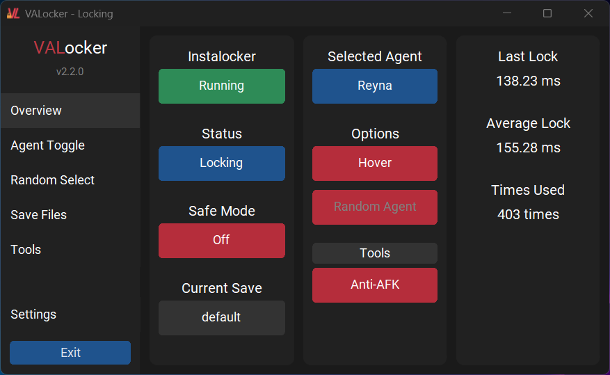
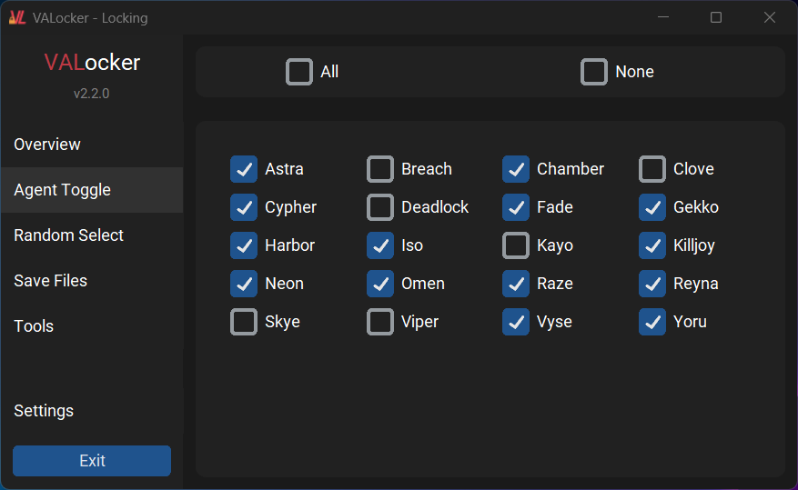
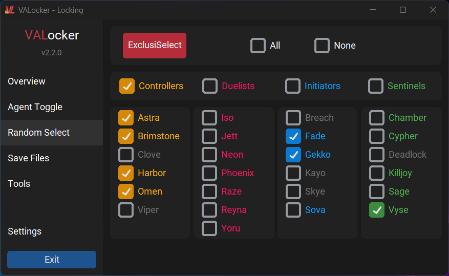
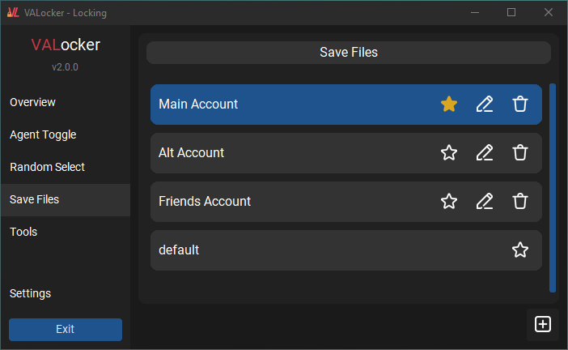
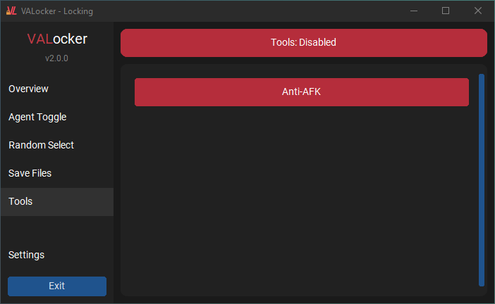

<h1 align="center">
  VALocker | VALORANT Agent Locker
</h1>

 

  
  
  
  

 

VALocker is a program written in Python that allows you to automatically lock any VALORANT agent quickly and reliably. It helps you secure your favorite agent during the agent selection phase, saving you time and ensuring you don't miss out on playing your preferred character.

**Regarding Updates**: Don't expect many updates to VALocker in the coming months. I am now studying full-time at university and don't know if I will have the time to play Valorant or/and work on VALocker. I intend to release VALocker V2 soon, with a more intuitive GUI, an easier-to-maintain file structure, auto-update capability, and the ability to play on other window resolutions.

📋 **Changelog:** For a detailed list of changes, improvements, and bug fixes, refer to the [Changelog](changelog.md) file.

> **Disclaimer:**
> This program is not affiliated with or endorsed by Riot Games or VALORANT. The software is provided "as is" without any warranty of any kind, express or implied, including but not limited to the warranties of merchantability, fitness for a particular purpose, and non-infringement. In no event shall the authors or copyright holders be liable for any claim, damages, or other liability, whether in an action of contract, tort, or otherwise, arising from, out of, or in connection with the software or the use or other dealings in the software.

## 📚 Features
- Provides a user-friendly GUI for easy interaction.
- Can be run as an executable, no Python installation required.
- Automatically checks for updates.
- Installs all necessary dependencies automatically.
- Allows the window to be minimized into an icon.
- Load-to-lock time of 70ms on average.
- Auto-detects game end screen for set-and-forget relocking.
- Supports map-specific agent locking.
- Random agent mode allows random agent selection from a pool, adding variety and reducing repetition.
- ExclusiSelect disables random agents after they're picked, ensuring a new agent every time.
- Hover mode allows you to select an agent without locking them.
- Safe mode adds random delays to the locking process for a more cautious approach.
  - Low 300-500ms
  - Medium 500-800ms
  - High 800-1000ms
- Tracks and displays average time to lock and last lock in real time.
- Selects random part of agent and locking button to deter detection.
- Allows for multiple save files for different accounts and/or configurations.
- Utilizes screenshot analysis to obtain game data, ensuring a safer approach and reducing the risk of bans compared to other aggressive methods such as direct memory reading.
- Automatically grabs your keybinds to ensure that the correct keys are pressed when using non-instalocking related functions.
- Features non-instalocking related tools to improve quality of life. Tools only work when the instalocker is disabled or "In Game". The currently implemented tools are:
  - Auto drop spike
  - Anti-AFK
    - Anti-AFK can be used in conjuction with the instalocker to take an break from your computer while queuing and return without being kicked for inactivity.
    - Anti-AFK automatically disables if your movement keys are pressed. If "GRAB_KEYBINDS" is set to false in the user settings file, if WASD are pressed.
> Tools are still a work in progress. Feel free to suggest any tools you would like to see implemented.

## ⚙️ Installation
### 💻 Executable
1. Download `VALocker.zip` from the [releases](https://github.com/E1Bos/VALocker/releases) page.
2. Extract the file to a location of your choice.
3. Run `VALocker.exe` to launch the application.

### 🐍 Python
1. Clone the repository to your local machine.
2. Make sure you have Python 3.x installed.
3. Run `VALocker.pyw` to launch the application, dependancies will be installed automatically.

### 🔄 Updating
1. Download the latest version from the [releases](https://github.com/E1Bos/VALocker/releases) page.
2. Close VALocker if it is currently running.
3. If using `VALocker.zip`, extract the `VALocker` folder to a location of your choice.
4. Replace all files in your VALocker directory with the new files. All your settings and save files should be preserved.

## 🚀 Usage
1. Run `VALocker.exe` to launch the application. If you are running the Python version, run `VALocker.pyw` instead, dependancies will be installed automatically.
2. Enable all your unlocked agents in the toggle agent screen.
3. Select your desired agent from the dropdown menu.
4. Choose any additional options or settings based on your preference.
5. Enable the instalocker by clicking on the button under "Instalocker" to initiate the agent locking process, the button should switch from "Stopped" to "Running", and the button titled "Current Task" should change to "Locking Agent".
6. During the agent selection phase in VALORANT, VALocker will automatically lock in your chosen agent.
7. Once the agent is locked, the button under "Current Task" will change to "In Game", once it detects the end of the game, it will automatically switch to "Locking". The mode can be changed at any time by clicking on the button.

### Notes:
- To function properly, VALORANT needs to be running at 1920x1080
- Your framerate must be capped. An uncapped framerate leads to the VALORANT UI not rendering properly.
- Any programs like AMD Radeon Image Sharpening or Nvidia Freestyle that modify the game's visuals should be disabled, they can slightly alter the UI and cause issues with VALocker.

## 🔧 Configuration
VALocker provides a `user_settings.json` file in the data directory where you can customize certain aspects of the program. The `user_settings.json` file is created when running the program for the first time. 

Settings should be changed via the settings tab. There are 3 settings that can only be changed in the `user_settings.json` file:

- `"LOCKING_CONFIRMATIONS`: Defaulted to `3`. This determines how many times VALocker needs to detect the agent selection screen before locking the agent. This is to prevent false positives.
- `"MENU_CONFIRMATIONS"`: Defaulted to `3`. This provides the same functionality as locking_confirmations but for the main menu.
- `"FAST_MODE_TIMINGS"`: Defaulted to `[0.02, 0.02, 0.02]`. When safe mode is disabled, this determines the time between `[0]`: moving the mouse and selecting the agent, `[1]`: selecting the agent and moving over the lock button, and `[2]`: clicking the lock button. Making these values any smaller may lead to VALORANT not registering the mouse input. These values are in seconds.

Please only edit these values if you know what you are doing.

## 📏 Display Size Compatibility
I plan to add support for other display sizes in the future, but for now, VALocker only supports a resolution of 1920x1080. If you would like to see support for other display sizes, please let me know by [creating an issue](https://github.com/E1Bos/VALocker/issues).

## 🖼️ Images
||||
|-|-|-|
|||
|

## 🎥 Video Demo

https://github.com/E1Bos/VALocker/assets/66886116/d1567740-3efe-408d-af09-fe2d2bf87f14

## 🤝 Contributing
Thank you for considering contributing to this project! I greatly appreciate your interest and support.

Please note that while I will be actively maintaining and updating this project, I may not actively review or accept pull requests for changes or additions at this time.

You are still welcome to fork this project and make your own modifications or enhancements. Feel free to experiment, customize, or extend the project based on your needs.

If you encounter any issues or bugs, please feel free to [create an issue](https://github.com/E1Bos/VALocker/issues) on the GitHub repository. I will do my best to address them and provide support.

Thank you for your understanding, and I appreciate your interest in this project!

## 🎉 Acknowledgements
VALocker utilizes the following libraries:

- [customtkinter](https://github.com/TomSchimansky/CustomTkinter) - Customized version of the tkinter library.
- [PIL](https://python-pillow.org/) - Python Imaging Library for image manipulation.
- [pystray](https://github.com/moses-palmer/pystray) - Library for creating system tray icons.
- [pynput](https://pypi.org/project/pynput/) - Library for controlling and monitoring input devices.

## 📧 Contact
If you have any questions, feedback, or general inquiries, you may contact me at:

Discord: @e1bos

Feel free to reach out through the provided contact information for non-issue related matters or general discussions. However, for any project-related issues, I kindly ask that you [add an issue](https://github.com/E1Bos/VALocker/issues) to report and discuss them.

Thank you for your understanding and cooperation.

## 📜 License
This project is licensed under the [MIT License](https://opensource.org/licenses/MIT). Please see the [LICENSE](LICENSE) file for more information.
